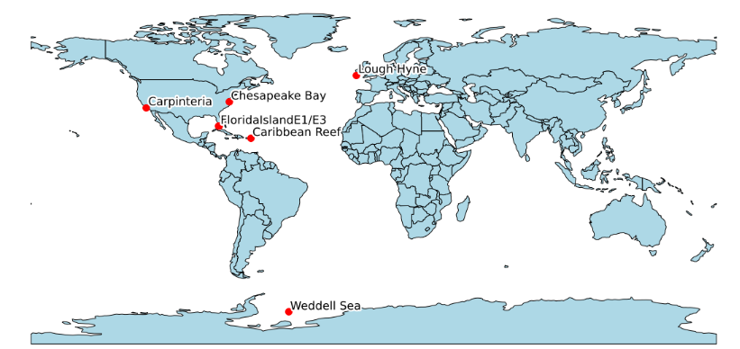

# Link Prediction in Ecological Networks

This project implements a method of link prediction on pairs of predator-prey species on the GATEWAy dataset by Brose et al (2019) dataset, using primarily the DeepWalk algorithm for generating embeddings of the network) and the Stellargraph library (for handling the dataset).

# Problem statement
This project evaluates a method of implementing link prediction on food webs. A diverse set of food webs from different parts of the world is used as the dataset. The dataset contains pairs of predator-prey species, which are used as pairs of source and destination nodes respectively. This project aims to find future links or uncover previously hidden connections among species. The nodes are first processed using StellarGraph, a Python library that is used for graph machine learning, and then passed through DeepWalk, an algorithm for learning latent representations of vertices in a network graph. Furthermore, the resulting embeddings are fed through a classifier for link prediction. The resulting prediction is then evaluated using ROC AUC as the metric. The results indicate that this technique has a moderate level of success.

# Dataset

The chosen dataset is the the GATEWAy database which is one of the largest collection of ecological networks, containing 290 food webs. It contains pairs of predator-prey species, and it includes characteristics such as species' length, mass, geographic location and others. We use pairs of predators and preys as nodes, with their consumption being the edge between them, resulting in multiple directed graphs, one for each web. Finally, we select only seven of the biggest webs as opposed to a composite graph of all the webs. This is done for a few reasons. The primary reason is that, while some webs do have species in common, in reality, it is unlikely that the webs interact, whether at present or in the future, since many of them are located tens of thousands of kilometers apart. Thus, a combined web with biomes from all across the world makes little sense. As for the food webs tested, they were selected chiefly for their size, having some of the largest number of nodes and samples in the dataset, which will be helpful in training the model.

# Methodology

We use an algorithm called DeepWalk to create a latent space representation of each graph, a process that generates node embeddings. These embeddings are created using only the structure of the graph and are then used for training the algorithm. It should be noted that we only use the node embeddings as input for the link prediction, and no other node features were used.

In order to link the samples to the embeddings, we test four different Binary Operators. Each graph is tested with each operator and the best performing one is chosen. For our classifier, our choice is the LogisticRegressionCV, as implemented in the sci-kit library. This classifier is preferred due to its built-in application of cross-validation. To determine the optimal values, the model was tested with different initial values for hyperpameters concerning the DeepWalk algorithm and the classifier. Using this process, it was determined that a low number of walks and a low number of dimensions should be passed to DeepWalk, with the other hyperparameters having negligible impact.

# Diagram
Below is a diagram of the model implementation.

# Results

Below a table of the results. The ROC AUC scores, which is our metric of choice, results in an average of 67% across the tested webs. In addition, presented below are two representative ROC curves for the Weddell Sea and the Lough Hyne food webs.

# Conclusions

We note that  the link prediction algorithm appears to perform moderately well. 
We can determine that the trained model could be used to uncover unknown pairs of predator-prey species. However, the model performance is not high enough so as to predict the future state of a web, and thus can’t be used fully predict the future state of network.

In addition, some errors appeared during the training of the model for some of the tested webs, especially those with a low number of samples. This is due to the random nature of the Edgesplitter command when splitting the dataset into three as well as the small number of nodes and samples for some webs.

Future research should investigate additional methods:
* An number of Deep Methods can be used such as Graph Neural Networks, which can make use of node features
* Use the method of Style Transfer for link prediction, using models such as the recently released DNformer

In conclusion, when used together with node embeddings, our method can potentially achieve higher accuracies. Nevertheless, this will likely come at the cost of needing more computing resources, whereas the present model needs comparatively little computing power to train.

# Appendix
The `Main_Document.ipynb` file was used for the task of creating the link prediction algorithm and the `Data_Exploration.ipynb` file was used for the task of analysing the GATEWAy dataset and for generating visualisations. Refer to `Paper.pdf` for more details about this project. 
